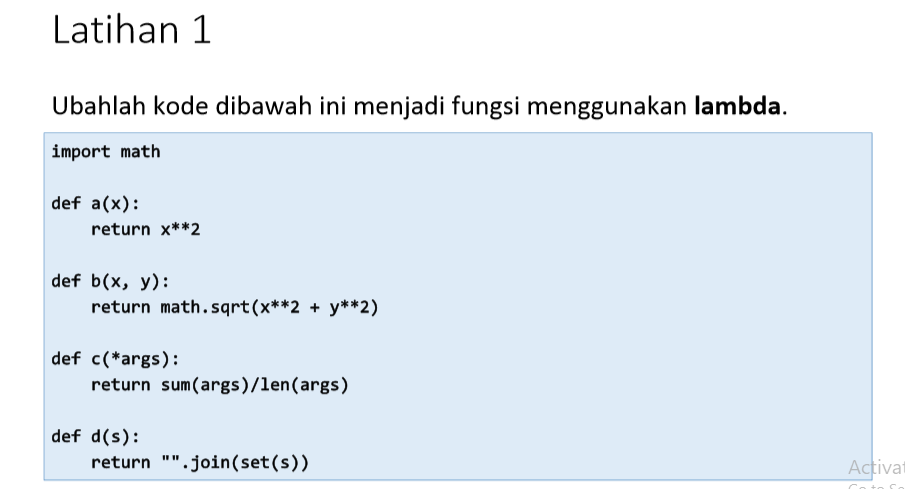
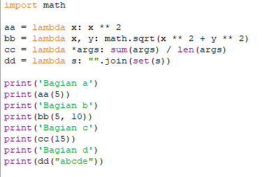
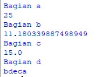

# Tugas Praktikum 6 - Pertemuan 10

Nama : Bangkit Akbar Anggara 
NIM : 312010148 
Kelas : TI.20.B.1 

Pada pertemuan 10 saya di berikan tugas dan latihan praktikum 6

# Latihan
Berikut adalah soal latihan praktikum 6: 

Berikut adalah syntax yang saya gunakan: 
 

Keterangan:
  - import digunakan untuk multi file maksudnya adalah kita dapat memanggil file lain di dalam satu module yang berbeda 
  - Lalu saya menggunakan double(aa,bb,cc,dd)karena dalam materi cara begitulah cara membuat fungsi lambda 
  - Lalu seperti biasa print kita gunakan untuk menulis kata - kata
  - Lalu print aa(5) adalah aa dari diuble tadi dan 5 adalah angka(bebas mau pake nomor berapa aja tapi saya disini mnggunakan angka 5)jadi nanti 5 ** 2 sama saja 5 X 5 sehingga hasilnya menjadi 25 
  - Lalu sqrt digunakan untuk mencari fungsi akar kuadrat dari 5 dan 10 
  - Lalu args digunakan untuk melewatkan satu atau beberapa argumen ke fungsi 
  - Lalu Join digunakan untuk menyatukan banyaknya string kedalam sebuah string 
  
Maka ketika kita run hasilnya akan seperti berikut 

# Tugas Praktikum 6
