# Tugas Praktikum 6 - Pertemuan 10

Nama : Bangkit Akbar Anggara 
NIM : 312010148 
Kelas : TI.20.B.1 

Pada pertemuan 10 saya di berikan tugas dan latihan praktikum 6

# Latihan
Berikut adalah soal latihan praktikum 6: 

Berikut adalah syntax yang saya gunakan: 
 
Keterangan:
  - import digunakan untuk multi file maksudnya adalah kita dapat memanggil file lain di dalam satu module yang berbeda 
  - Lalu saya menggunakan double(aa,bb,cc,dd)karena dalam materi begitulah cara membuat fungsi lambda 
  - Lalu seperti biasa print kita gunakan untuk menulis kata - kata
  - Lalu print aa(5) adalah aa dari diuble tadi dan 5 adalah angka(bebas mau pake nomor berapa aja tapi saya disini mnggunakan angka 5)jadi nanti 5 ** 2 sama saja 5 X 5 sehingga hasilnya menjadi 25 
  - Lalu sqrt digunakan untuk mencari fungsi akar kuadrat dari 5 dan 10 
  - Lalu args digunakan untuk melewatkan satu atau beberapa argumen ke fungsi 
  - Lalu Join digunakan untuk menyatukan banyaknya string kedalam sebuah string 
  
Maka ketika kita run hasilnya akan seperti berikut 

# Tugas Praktikum 6

Berikut adalah tugas praktikum 6: 
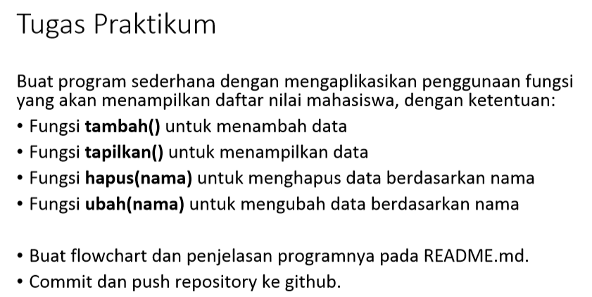 

Untuk source code yang saya gunakan silahkan kalian klik tombol di samping:  [Click Here](prakikum_6.py)

Baiklah saya akan menjelaskan fungsi - fungsi dari syntax tersebut: 

1. Disini saya menggunakan dictionary 
  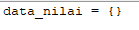 
Keterangan: 
    - Kalian bisa menggunakan list atau dictionary sesuai keinginan kalian sendiri tapi tentu saja list dan dictionary berbeda ya tapi tujuannya sama 

2. Tambah data nilai mahasiswa 
  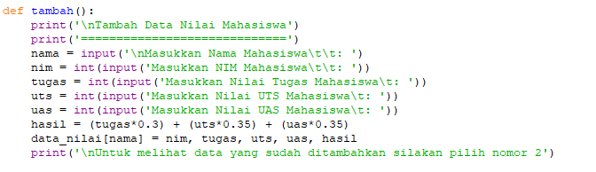 
Keterangan: 
    - def tambah, def digunakan untuk membuat fungsi lalu tambah digunakan agar ketika kita memilih menu tambah langsung mengeksekusi syntax tersebut 
    - Lalu kita buat inputan nama, nim, nilai tugas, nilai uts, dan nilai uas, lalu kita buat hasil / total dari keseluruhan nilai 
  
3. Hapus data nilai mahasiswa 
  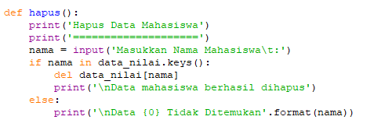 
Keterangan: 
    - Lalu seperti biasa kita gunakan def hapus agar ketika kita memilih pilihan menu hapus akan masuk ke dalam syntax ini untuk menghapus data 
    - Kita buat inputan nama karena kita akan menghapus data nilai mahasiswa tersebut dengan menggunakan nama mereka untuk menghapusnya 
    - lalu gunakan if untuk mengeksekusi data yang di dictionary menggunakan nama(True) 
    - Lalu del untuk menghapus semua data nilai mahasiswa tersebut 
    - Lalu kita buat else gunanya untuk ketika kita belum menginputkan data apapun maka tidak ada data yang bisa di hapus(False) 

4. Ubah data nilai mahasiswa 
  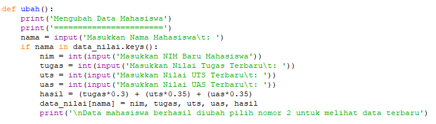 
Keterangan: 
    -  kita gunakan def ubah agar ketika kita memilih pilihan menu ubah akan masuk ke dalam syntax ini untuk mengubah data  
    - Lalu kita buat inputan nama karena kita akan mengubah data nilai mahasiswa dengan menginputkan nama mahasiswa tersebut 
    - Lalu if nama in data_nilai.keys untuk mengeksekusi jika nama terdapat di dalam dictionary 
    - Lalu kita buat inputan untuk memasukkan nilai tugas, uts, dan uas yang terbaru 
    - Lalu kita gunakan hasil untuk menghitung total semua nilai tersebut 

5. Tampilkan data nilai mahasiswa 
  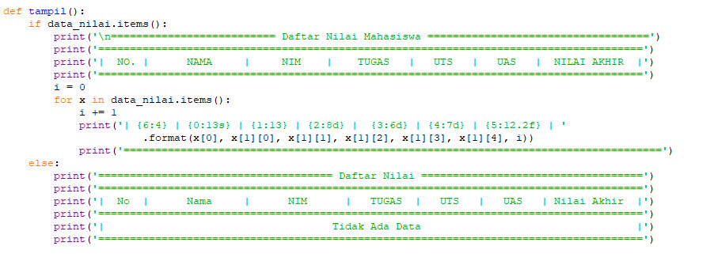 
Keterangan: 
    - kita gunakan if data_nilai.items gunanya untuk melihat hasil / menampilkan semua data di dalam dictionary(True) 
    - Lalu kita gunakan print untuk membuat tablenya 
    - Lalu for i = 0 digunakan untuk membuat nomor urut otomatis dibagian No. didalam table 
    - Lalu kita gunakan for x gunanya untuk format penampilan data nilai mahasiswa 
    - lalu gunanya angka yang di dalam {} itu di gunakan untuk membatasi atau bisa di bilang seperti tab agar data yang di tampilkan lebih rapih 
    - Lalu else disini di gunakan ketika kita belum menginputkan atau menambahkan data apapun akan muncul tidak ada data(False) 

6. Membuat pilihan menu 
  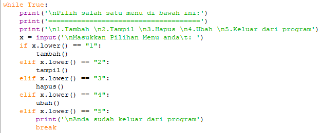 
Keterangan: 
    - Kita gunakan perulangan while True untuk membuat pilihan menunya 
    - Karena tidak disuruh untuk menampilkan outputnya seperti apa jadi saya menggunakan nomor saja untuk membuat pilihan menunya alasannya agar terlihat lebih rapih dan mudah 
    - Lalu kita buat dibawahnya inputan untuk memasukkan pilihan yang kita inginkan 
    - Lalu kita gunakan if dan elif agar ketika kita memiih menu 1, 2, 3, 4, atau 5 kita akan memasuki syntax yang def tadi 
    - Lalu dibawahnya kita gunakan tambah, tampil, hapus, dan ubah untuk mengeksekusi syntax yang tadi, itulah kenapa kita menulisnya def tambah, def tampil, def hapus, dan def ubah 
    - lalu kita break kita gunakan untuk keluar dari program tersebut 
    - Lalu else digunakan agar ketika kita tidak memilih pilihan menu maka akan muncul tulisan "pilih menu yang tersedia diatas" 

Maka ini adalah hasil running dari syntax di atas:

1. Pilihan menu tambah, tampil, hapus, ubah, dan keluar dari program 
  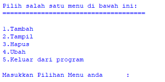 

2. Tambah data nilai mahasiswa 
  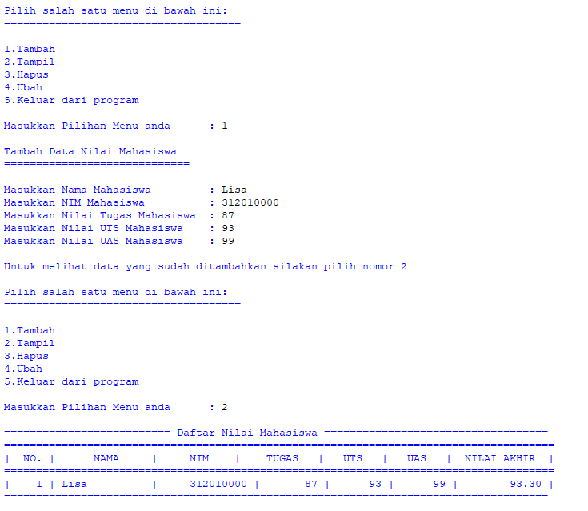 
  

3. Tampilkan data nilai mahasiwa 
  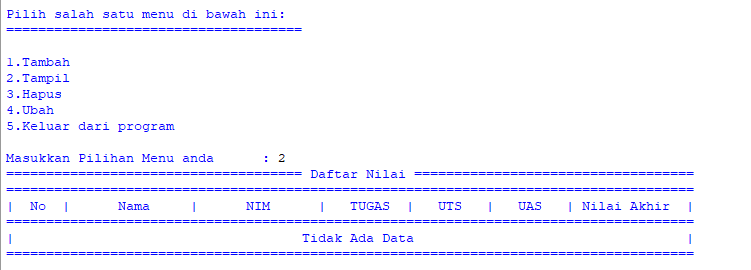 
  

4. Hapus data nilai mahasiswa 
  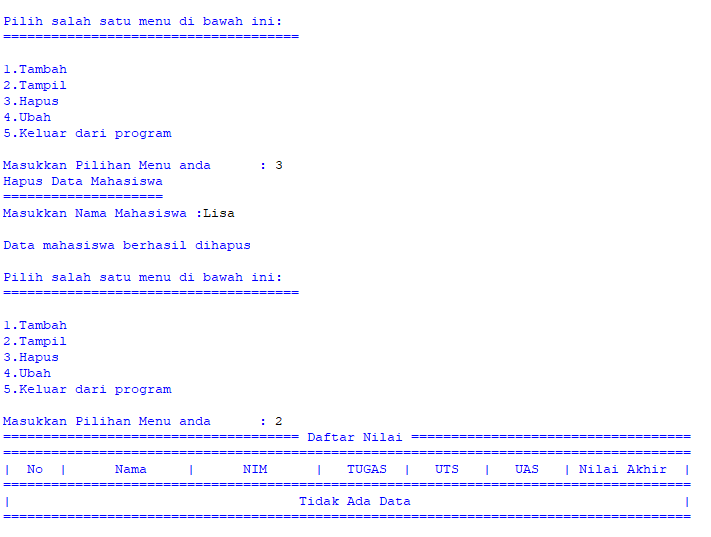 
  
5. Ubah data nilai mahasiswa 
  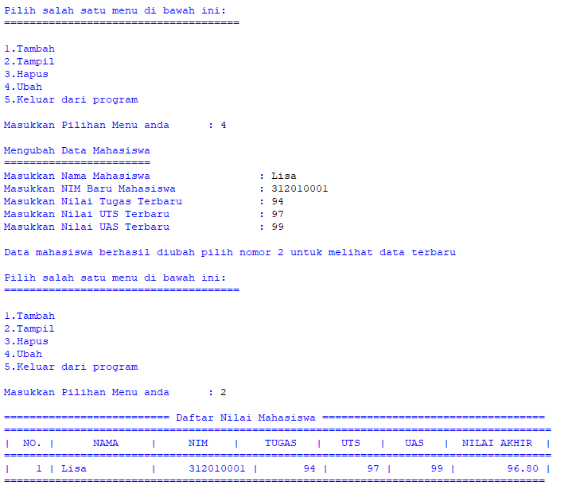 
  

6. Keluar dari program 
  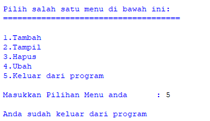 

7. Ketika kita tidak memilih pilihan menu 
  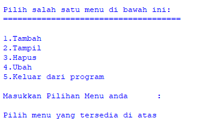 

Oke sekian penjelasan dari saya kurang lebihnya mohon maaf Wassalamualaikum wr.wb. 
Sampai jumpa lagi 

by: 
 _== Bangkit Akbar Anggara ==_ 
 _== 312010148 ==_ 
 _== TI.20.B.1 ==_ 
